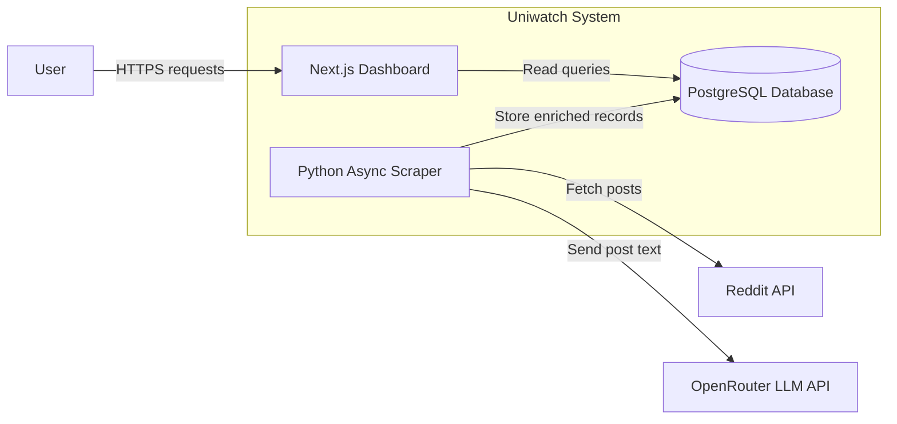

# Uniwatch
Uniwatch continuously collects and classify public Reddit posts from Australian and New Zealand university subreddits, allowing you to query discussions.

Hosted at: [Uniwatch](https://uniwatch.minhn.me/)

## Features
- Async scraper collecting posts from 47 university subreddits via Reddit API (asyncpraw)
- Multi-dimensional content classification including sentiment, emotion, irony, and 19 topic categories using LLM-based labeling (OpenRouter API)
- High-performance data layer with PostgreSQL, including normalized schema and denormalized response views for analytics
- Optimised query performance using composite indexes (hot, top, controversial, new) and cursor-based pagination
- Responsive web dashboard with SSR for fast load times and SEO-friendly rendering
- Real-time data exploration interface for browsing and filtering scraped Reddit content

## Architecture


## Tech stack
### Backend
- Python (asyncpraw)
- OpenRouter API (LLM classification)
### Database
- PostgreSQL
### Frontend
- Next.js 16 (React 19)
- TypeScript
- Tailwind CSS
- daisyUI
- Kysely
### Infrastructure
- Docker / Docker Compose
- Caddy reverse proxy (HTTPS)
- Vultr VPS
- GitHub Actions CI/CD

## Deployment
```sh
git clone git@github.com:Minh7080/uniwatch.git
cd Uniwatch

docker compose up --build
```
Ensure to fill in the environment variables in of all files in `Uniwatch/env/` directory before running `docker compose up --build`
